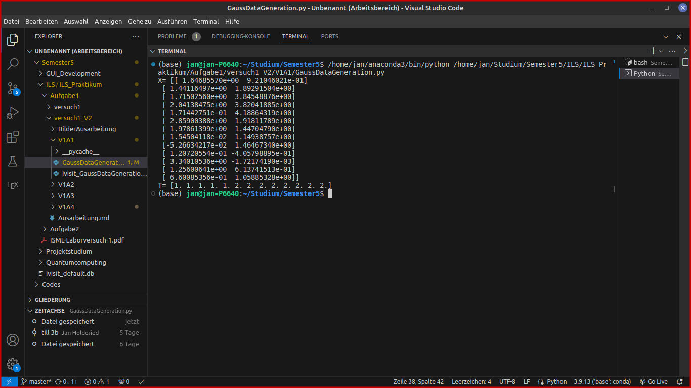
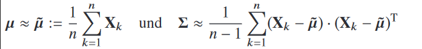
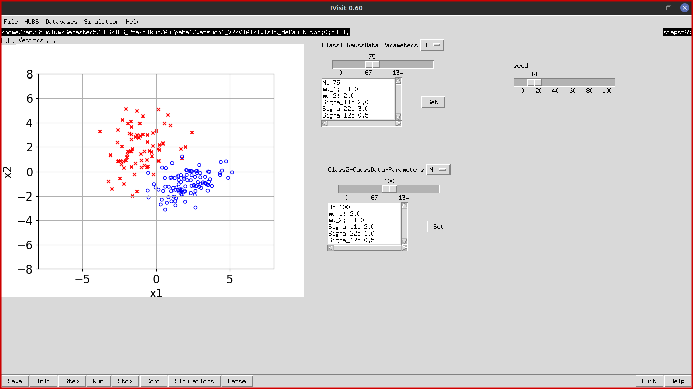
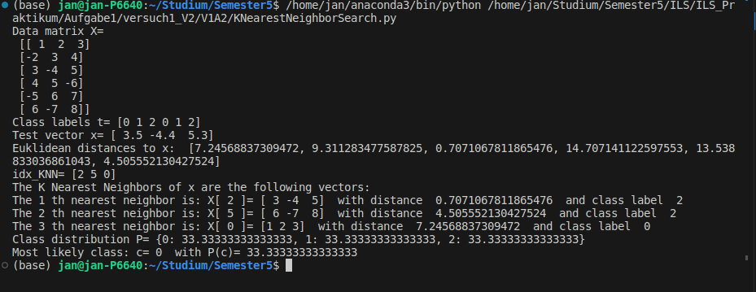
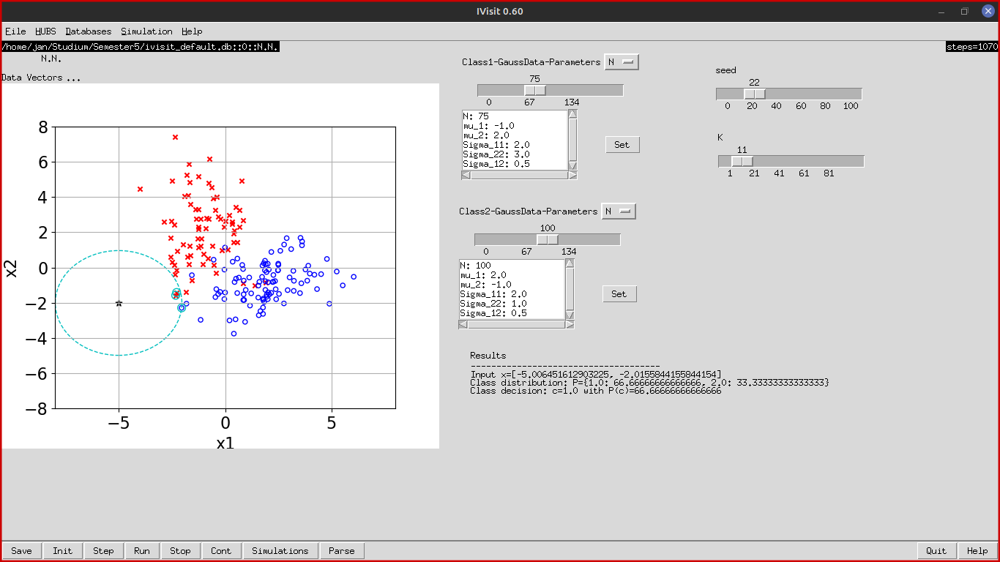
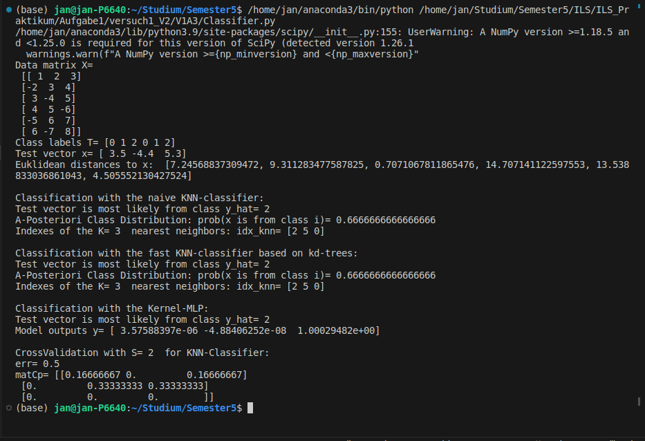
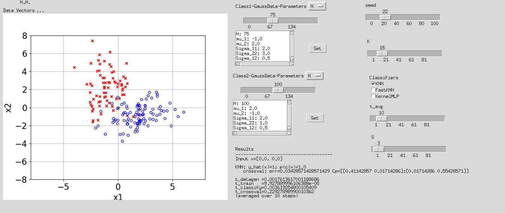

# Ausarbeitung Versuch 1 ILS
## Aufgabe 1
### b)

Formeln um Mittelwert und Kovarianz zu schätzen. Siehe im Pythonskript die Funktionen ApproxMean und ApproxCovariance.

### c)

## Aufgabe 2
### d)

### e)
* Die Funkrion def onPressedB1_datvec(self,event) ist dafür da, um mit der Maus im Graphen eine (x,y) Koordinate auszuwähle, welche dann als neuer Datenvektor x verwendet werden soll. Die Funktion holt sich die x und die y Koordinaten, die mit der Maus ausgewählt wurden.
* Die Funktion def bind(self,parent=None,display=None) ist dafür zuständig das Bild bzw den Graphen an das Mausklick Event zu binden. Das Event soll nähmlich nur ausgelöst werden wenn in einer Region auf dem Graphen geklickt wird.
* Der türkise Kreis um den Datenvektor x wird sehr groß, wenn x sehr weit entfernt von den Trainingsdaten X ist.
* Falls ein sehr großes K gewählt wird, bedeutet dass, das ein sehr großer Teil der X Daten mit einbezogen werden müssen. Somit ist dann auch die Region die betrachtet werden muss sehr groß und die Klassenentscheidung für den neuen Datenvektor x wird ungenauer.
* Der Vorteil eines ungeradem K ist, dass niemals alle Klassen mit der gleichen Verteilung vorkommen können. Somit kann immer eine eindeutige Klassenentscheidung getroffen werden.

### f)
Die Naive brechenung bei KNN werden O(ND) Schritte benötigt also Linear. Um das Verfahren zu beschleunigen, können KD-Trees verwendet werden, die bei guter Pivotisierung eine logarithmische Laufzeit erreichen, also O(log N).

## Aufgabe 3
### a)
Der Abstrakte Konstrukter der Klasse Classifier, übergibt den Paramter C an sein Attribut C. C legt die anzahl an möglichen Klassen fest, in die die Daten unterteilt werden können.

Die Methode fit wird für das Trainieren des Klassifikators benutzt. Die Methode bekommt die Parameter X und T, wobei X die Daten und T die dazugehörigen Klassenlabel sind.

Die Methode predict Klassifiziert anhand des Trainings neu übergabene Daten ein. Als Parameter übergibt man Predict z.B. einen neuen Vektor um ihn Klassifizieren zu lasse.

Die Methode Crossvalidate teilt die Daten in S Teile auf. Der Parameter X ist für die Übergabe der Daten zuständig und der Parameter S gibt an, in wie viele Blöcke die Daten X geteilt werden sollen. Der dritte Parameter T sind die Klassenlabel für die Daten in X. Die Methode Crossvalidate macht eine Kreuzvalidierung mit dem Entsprachenden Modell in dem sie implementiert wird. Dies bedeutet, dass die Daten in X in S Blöcke geteilt werden und ein Block nicht zum Trainieren verwendet wird, sondern zum Validieren. Die Kreuzvalidierung macht jedoch mit jedem Block aus X eine Validierung und mittelt daraus dann die Genauigkeit.

### b)
* Das Array in idxS enthält die Einträge bei den Parametern N=9 und S=3 [range(0, 3), range(3, 6), range(6, 9)]. Das Array aus 9 Daten soll in 3 gleich große Teile aufgeteilt werden. somit kommen dann die drei ranges zu stande.
* idxVal enthält für jeden Schleifendurchgang einen der range Einträge aus der Liste idxS. idxTrain enthält die restlichen Blöcke die nicht in der Range von idxVal liegen.
* In perm ist eine zufällige Reihenfolge aus Indexen für X. Dies ist sinnvoll, da wir die Daten in X nicht in der vorgegeben Reihenfolge verarbeiten wollen, da diese schon eine Art Ordung haben könnten. Somit indizieren wir mit einer Range aus den perm Indexen auf die Daten X und die Label T mit denen wir dann das Modell trainieren wollen.
* 1 Durchlauf: x[3], x[1], x[0]
2 Durchlauf: x[8], x[2], x[4]
3 Durchlauf: x[7], x[5], x[6]
* Der Returnwert err ist der prediction error, die Formel dafür befindet sich auf Seite 115 Nummer 2.108 (FP + FN) / (TP + FP + FN + TN). Der Returnwert MatCp ist die Confusion Matrix welche die Werte False Positive (FP), False Negative (FN), True Positive (TP) und True Negative (TN) enthält.

### f)

### g)

Der kleineste Error, wurde mit K = 15 erreicht.

* Was passiert im Fall vieler Daten (N1, N2 groß), falls die Daten gut getrennt sind
gegenüber dem Fall wenn die Daten stark überlappen?
    * Bei vielen Daten kann die Invertierung der Gram-matrix sehr aufwändig werden. O(n^3) Rechenschritte.

* Warum funktioniert KernelMLP im letzteren Fall nicht so gut?
    * Wenn die Daten stark überlappen, wird die Aufgabe für das Modell schwieriger. In diesem Fall kann es schwieriger sein, klare Trennlinien zwischen den Klassen zu ziehen. KernelMLP kann in diesem Szenario möglicherweise nicht so gut funktionieren, weil es möglicherweise Schwierigkeiten hat, die komplexen nicht-linearen Muster zu erfassen, die durch die Überlappung entstehen. Modelle mit nicht-linearen Kernen können in solchen Fällen anfälliger für Overfitting sein.
* Vergleichen Sie für die Datenparameter von Aufg.1c die Laufzeiten der drei Verfahren für Kreuzvalidierung für Datenzahl N = 10, 100, 1000 (mit N1 = N2 = N /2). Tragen Sie die Werte jeweils in ein Schaubild ein.

## Aufgabe 4
