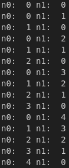

# Ausarbeitung Versuch 2 ILS Jan Holderied und Martin Goien
## Aufgabe 1
### a)
* Die Lambda Funktion nimmt das erste Element von x und Potenziert es mit n=3.
* Die Liste Phi für m = 5 enthält, 6 Einträge, die jeweils einer Funktion entsprechen: x[0]\**0 bis x[0]\**5
* Beim Aufrufen der Funktion get_phi_polyD1(m) wird die Funktion lambda x: np.array([phi_j(x) for phi_j in phi]) zurückgegeben. Beim Anwenden der zurückgegebenen Funktion auf verschiedene Werte von x, wird ein Numpy-Array zurückgegeben. Das Numpy-Array wird durch die m lambda Funktionen in der Liste phi berechnet. Für m=5 wird eine Liste aus von 6 lambda Funktionen zurückgegeben, die die Potenzen x[0]\**0 bis x[0]\**5 bilden.
* Bei der Erzeugung der lambda Funktionen wird n jeweils durch die funktion range() erzeugt. Um nun n innerhalb der Anonymen Funtion zu speichern, wird n dem Parameter n zugewießen, damit der wert von n beim späteren Aufruf vernwendet werden kann.
* Phi ist eine Liste von m+1 lambda Funktionen. Lambda x erzeugt ein Numpy-Array mit Werten, die mit Hilfe der m+1 lambda Funktionen aus Phi berechnet werden.
* phi_poly1D([2]) = [ 1  2  4  8 16 32]

### b)
* n0, n1 sind die Exponenten der Polynome für die jeweiligen Merkmalsfunktionen, wobei n jewieils für den Grad 0 bis m steht.
* 
* Es gibt $\binom{D+m-1}{m}$ viele Basisfunktionen vom Grad m.
* phi_poly2D([1,2])= [ 1  2  1  4  2  1  8  4  2  1 16  8  4  2  1]

## Aufgabe 2
### a)
* Es gibt folgende Klassen im Modul Regression:
    * DataScaler: Klasse um Datenvektoren zu standardisieren.
    * KNNRegressifier: Klasse für K-Nearest-Neighbor-Regressions Verfahren mit Hilfe von KD-Trees.
    * LSRRegressifier: Klasse für Least Squares Regression, Summe der Fehlerquadrate.
    * Regressifier: Abstrakte Basisklasse. Obige Regressionsklassen erben von dieser Klasse.
* Die Methoden der Basisklasse Regression sind folgende:
    * fit(): Die Methode fit Trainiert das Regressionsmodell mit den Trainigsdaten Matrix X und den Zieldaten Matrix T
    * predict(): Bekommt als Parameter einen neuen Datenvektor x, für den dann ein Zielvektor berechnet werden soll.
    * crossvalidate(): Macht eine Kreuzvalidierung. Parameter S bestimmt in wie viele Teile die Daten X unterteilt werden sollen. X ist die Trainingsdaten Matrix. T ist die Zeilwerte Matrix. Dist(t) berechnet die länge jedes einzelnen Vektors t, default ist die Euklidische Distanz.

### b)
* Die Klasse LSRRegressifier erzeugt ein Objekt, dass ein Regressionsverfahren auf Basis der Summe der Fehlerquadrate implementiert.
* Die Parameter der Klasse LSRRegressidier:
    * lmbda: Ist ein Regulariserungs Parameter. Dieser verhindert zu große Gewichte, zwingt viele Komponenten auf nahe 0, reduziert effektive Parameterzahl.
    * phi: Basisfunktionen phi für lineare Regression, default ist ein Polynom mit Grad eins.
    * flagsSTD: Ist ein Flag welches bei einem Wert von größer 0 aussagt, dass die Daten Standartisiert sind.
    * eps: Maximal tolerierbarer Restwert, default ist $1*10^{-2}$
* Die Klasse DataScaler dient dafür die Datenvektoren zu standardisieren.
    * scale(): Methode standardisiert einen Vektor oder eine Matrix, auf Mittelwert 0 und Standartabweichung 1.
    * unscale(): Diese Methode rechnet für einen Vektor oder eine Datenmatrix die Standardisierung wieder zurück, auf die uhrsprüngliche Verteilung.
    * Dies ist wichtig um das Regressionsverfahren Numerisch Stabil zu halten.
    * maxZ: Variable steht für die Maximal zulässige größe der Datenmatrix X, damit diese noch gut konditioniert ist.
    * Z: Bei guter konditionierung wird Z zur null Matrix.

### c)
* Die Klasse KNNRegressifier berechnet ein Regression mit Hilfe des Fast K-Nearest Neighbors Modells. Es wird ein KD-Tree verwendet.
* Wo zu dienen die Parameter:
    * K: gibt die Anzahl der K-Neighbors an
    * flagKLinReg: Wenn diese Variable >0 ist soll eine Lineare Least Squares Fehlerfunktionen auf die K-Neighbors angewandt werden. Bei = 0, soll einfach nur der Mittelwert der K-Neighbors Zielwerte Vektoren berechnet werden.
* Als erstes werden die Indexe der K-Nearest Neighbors berechnet und in einer Liste abgelegt. Wenn das Flag flagKLinReg gleich null ist wird einfach der Mittelwert aus den Zielwerten berechnet. Wenn das Flag flagKLinReg größer null ist, wird aus den Daten ein Regressionsmodell erzeugt, mit Hilfe der Klasse LSRRegressifier. Danach wird der Zielwert des Datum x mit der predict Methode der Klasse LSRRegressifier brechnet. 

### d)
* Im Modultest werden als ertses alle nötigen wie Daten T und X erzeugt. T wird hier mir einem noise versehen. Ebenfalls wird die Merkmalsfunktion $\phi$ mit Dimensions 1 und Grad 2 erzeugt. Danach wird ein Objekt von LSRRegressifier erzeugt und Trainiert. Mit dem Trainierten LSRRegressifier wird nun eine prediction mit dem neuen Datum [3.1415] berechnet. Das Modell wird anschließend Kreuzvalidiert um einen mean absolute und einen mean absolute perecentage error zu berechnen. Anschliesen wird ein Objekt des KNNRegressifier erzeugt und dieses Trainiert. Hier wird ebenfall mit dem Datum [3.1415] eine prediction berechnet. Auch hier wird das Modell wieder Kreuzvalidiert.
*
* MAE $\triangleq$ mean absolute error, MAEP $\triangleq$ mean absolute percentage error
    * MAE ist also der durchschnittliche Regressionsfehler der vom Modell gemacht wird
    * MAEP ist der durchschnittliche Regressionsfehler in Prozent der vom Modell gemacht wird
* 