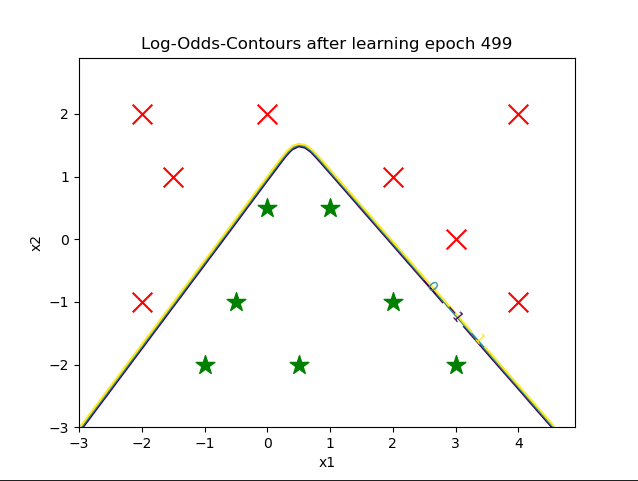
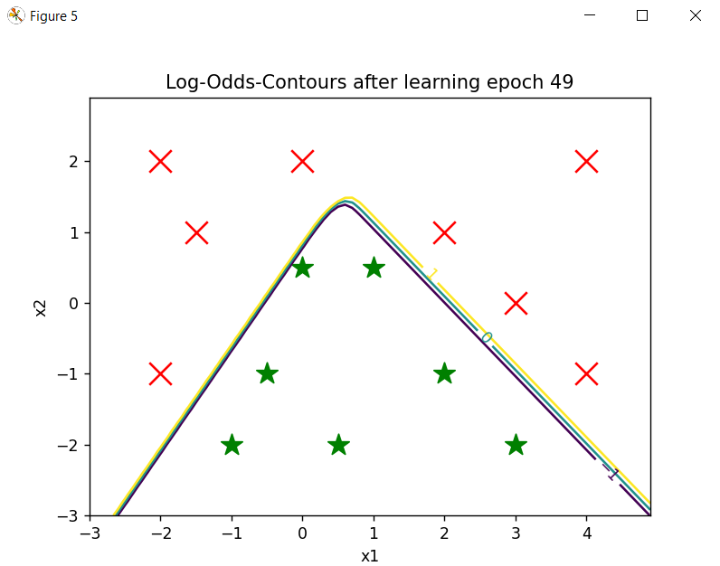

# Ausarbeitung Versuch 3 ILS Jan Holderied und Martin Goien
## Aufgabe 1
### a)
* sofmax(a): Berechnet die Softmax funktion für eine potentiellen Vektor a. Die Softmaxfunktion ist die Normalisierte Expontialfunktion. a ist ein Vektor der Dentritischen Potentialen. Returned einen Vektor der gleichen länge wie a.
* def forwardPropagateActivity(x,W1,W2,flagBiasUnit=1): Propagiert die Neuronale Aktivität durch das Netzwerk in die forwärts Richtung. Startet beim Input und Endet beim Output.
* def backPropagateErrors(z_1,z_2,t,W1,W2,flagBiasUnit=1):  Zurückpropagieren der Fehlersignale die rückwärts durch das Netzwerk. Bedeutet von der Outputlayer zur Inputlayer.
* def doLearningStep(W1,W2,xn,tn,eta,lmbda_by_N=0,flagBiasUnit=1): Einen Lernschritt vornehmen mit Input Datenvektor und dem dazugehörigen Zielvaktor. Innerhalb des Lernschritts wird gleich der Backpropagation Algorithmus angewandt. Rückgabewert ist die geupdatete Gewichtsmatrix für jede Layer.
* def getError(W1,W2,X,T,lmbda=0,flagBiasUnit=1): Berechnet den Kreuzentropiefehler für das gesamte Datenset für die MLP Gewichtsmatrizen W1 und W2. Zurückgegeben wird der Final berechnete Fehler.
* plotDecisionSurface(W1,W2,gridX,gridY,dataX1,dataX2,contlevels,epoch,flagBiasUnit=1): Zeigt als Plot die Klassengrenzen Oberfläche nach Training des Modells.

### e)
* Im Hauptprogramm werden als erstes alle Daten benötigten Daten generiert. Danach werden alle benötigenten Hyperparameter für das Modell initialisiert und definiert. Anschließend wird eine for Schleife betreten die so oft durchläuft wie Lernepochen definiert wurden. Innerhalb der Schleife wird das Modell Vorwärtspropagiert und Rückwärtspropagiert und ein Plot bei gewissen Lernschrittanzahlen erzeugt der die Diskriminanzfunktion mit den Daten zeigt.
* Hyperparameter
    * M : Anzahl der Neuronenschichten
    * eta: Lernrate
    * nEpochs: Anzahl der Lerndurchläufe
    * flagBiasUnit: Legt fest ob ein Bias verwendet werden soll oder nicht. Der Bias sorgt für mehr flexibilität des Netzwerkes
* Wir haben eine korrekte Klassifikation mit minimal 50 Itterationen geschafft. Dabei waren die Hyperparamter M=3, eta=0.9, lambda=0.
