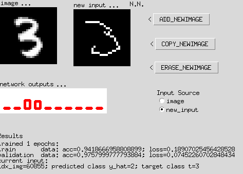

# Ausarbeitung Versuch 3 ILS Jan Holderied und Martin Goien
## Aufgabe 1
### a)
* Normalize Image: Die Pixelwerte der Bilder werden Normaliesiert um eine bessere Konvergenz beim Lernen zu bekommen und die Stabilität des Trainings zu erhöhen. Dies wird erreicht in dem man jeden Pixelwert durch 255 dividiert und dann 0,5 subtrahiert, damit liegen alle Pixelwerte zwischen -0,5 und 0,5.
* Reshape the images: Es wird ein weitere Dimension/Kanal zu den Daten hinzugefügt, da die CNN Netzwerke das Format (Batch-Größe, Höhe, Breite, Kanäle) erwarten. Es wird einfach ein Kanal mit den Werten 1 hinzugefügt.

### b)
* Hyperparameter
    * num_filters = 4: Anzahl der Filter
    * filter_size = 3: Größe der Filter Layers
    * pool_size = 2: Größe der Pooling Layers
    * eta = 1e-4: Lernrate für den Gradientenabstieg
    * opt_alg=SGD(lea:rning_rate=eta):
    * batchsize=50: n Bilder die pro Gewichtsupdate zum Lernen verwendet werden sollen. 50 pro Batch in diesem Fall.
    * epochs=5: Anzahl der Trainingsepochen.
* Skizze des Netzwerks
* Größe des Netzwerks:

* In der Layer Conv2D-Schicht entspricht die Anzahl Physischier-Synapsen nicht der Anzahl unabhängiger trainierbarer Parameter. 
Conv2D-Schicht: Anzahl der Physischen-Synapsen: 200 
Anzahl der unabhänigen trainierbaren Parametern: 208 

### c)
Hier kann man die erreichte Accuracy mit den standart Hyperparamter sehen. 

### d)
Hier kann man die TensorBoard Auwertung sehen. 

### e)
* Die größte Auswirkung auf die Accuracy hat die Lernrate.
* Für sehr kleine Mini-Batches ist die Modellberechnung sehr viel langsamer und damit konvergiert auch das Modell seht viel langsamer
* Eine bessere Leistung als der einfache Stochastische Gradientenabstieg(SGD) ist der der Adaptive Moment Astimation (ADAM). Er passt die Lernrate für jedes Gewicht seperat an und berücksichtigt den ersten und auch den zweiten Moment der Gradienten.

## Aufgabe 2
### a)
Es fällt zum Beispiel auf das bei der sieben auch eine Amerikanische schreibweise vorhanden ist, bei der es keinen querstrich gibt.

### b)

### c)

### d)

Es wurde eine Accuracy von 60% erreicht bei den selbst gezeichneten dreiern.

### e)

### f)
Leider war es uns nicht möglich die fünf so zu manipulieren das eine sechs erkannt wurde. Meistens wurde eine 8 oder teilweise auch eine drei erkannt.